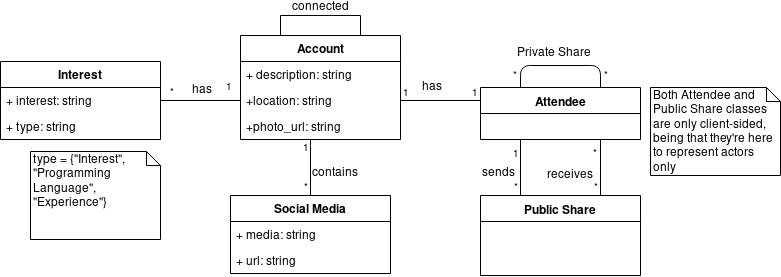

# Commun.io
Passively Networking

## Development
### Requirements
Want to contribute to this project? Here are some requirements you will need!
 - Flutter
 - Dart
 - OpenCX Server - you can use ours at https://open-cx-communio.herokuapp.com/

Add a .env file at the root of the communio with the following information
```
API_URL=https://open-cx-communio.herokuapp.com/
```

## Business Modeling
### Vision
Our App aims to:

- provide one to one social media exchange
- allow the broadcast of social media information
- permit the filtering of incoming data based on defined preferences

It is directed towards:
    
- conference attendees seeking to expand their network
- recruiters looking for specialized people
- communities intending to broaden their audience
  
The atendees will benefit from maximizing their networking opportunities, as they will be equipped with the means to easily exchange their social media information.

Conferences, on the other hand, will profit from their now enhanced ability to form a densely connected community out of their audience, at a very small cost to themselves.

### Elevator Pitch
Ever felt like you lose contact with every awesome person you meet during a conference? Ever felt like
it is impossible for you to find the people whose interests are shared with you? Commun.io has a solution for you! Have the ability to find those close to you whom you can share your thoughts.
Commun.io - networking from the comfort of your pocket


## Requirements
### User stories
To check our current user stories, come to our [Trello](https://trello.com/b/Og2YbLLu/communio)!

### Use Case Diagram
<div align="center">
  
</div>

### Domain Model
<div align="center">
  
</div>

## Architecture and Design
### Logical Architecture
The application uses an Architecture of the well known architecture MVC mixed with a Redux implementation. This means the state transition is a bit more complicated than a traditional MVC, though it does compensate in keeping a global state of the App.

<div align="center">
  
</div>

### Physical Architecture

#### Component Diagram
<div align="center">
  
</div>

#### Deployment Diagram
<div align="center">
  
</div>

#### Prototype
Communio is an app that allows users to connect with each other and to share their social media information without the need for physical interaction.

The app allows you to connect to people using two different methods:
- Locally search for those whose interests you are looking. User our permissive filters to make a more narrowed query and pin down the person you are looking for. Send them a friend request when you do find the right match.
- Swap your information directly with a person you've met, by scanning their QR code.

In your profile page, you can make a personalized description of yourself that others will be able to see, when they connect with you. Furthermore, you can control the social media that others can access. Moreover,add tags to give a simple overview of your Interests, Programming Languages and Skills, so others can easily discover you when filtering.


For the development of this application, these user stories were sucessfully concluded:
- "As a speaker, I want to be able to access the people interested in trading ideas with me, so that I can further explore the topics approached in my talks." "As a job recruiter, I want to conveniently see the people I have connected with, so that I can better decide which people to pursue as potential hires."
- "As a user I want to be able to see the people close to me during the conference and be able to connect with them."
- "As a user, I want my theme to be used on all the pages I see in the application."
- "As a user I want to be able to recap my profile information as well as adding/deleting new information regarding myself."
- "As a user, I want to be able to select which device I use to broadcast my information, either an external device or my own phone."
- "As a user, I want to be able to selectively connect with people I cross paths with, so that I can gain new connections while being able to control who has access to my information."
- "As a user I want to be able to create my own profile with my personal information using a simple form."
- "As a user I want my personal information to be real and portray the actions I take inside the application."
- "As a user, I want the page where I create my profile for the first time to be more user-friendly and to truly create a profile."
- "As a user, I want to be able to send a friend request to people I meet online, as well as receive friend requests."
- "As a user I want all of the experience to provide me a real response regarding the world around me."
- "As a user, I want my profile page to have a cleaner and simple design."


### Test
#### Test Plan
In order to test this app, both [flutter gherkin](https://pub.dev/packages/flutter_gherkin) and [flutter_test](https://api.flutter.dev/flutter/flutter_test/flutter_test-library.html) are used to develop acceptance tests and unit tests respectively.

Project must have test cases for each of the following feaures:
- Connection to people locally
- Handling Friend Requests
- Editing your Profile.

Tests for all of these features were implemented.
#### Test Case Specification
Acceptance Tests for all of the user stories were added to each User Story Card. They were implemented using [flutter gherkin](https://pub.dev/packages/flutter_gherkin). The implementation can be found in the `flutter_driver` folder. Furthermore, in the `test` folder, some unit tests can be found.

